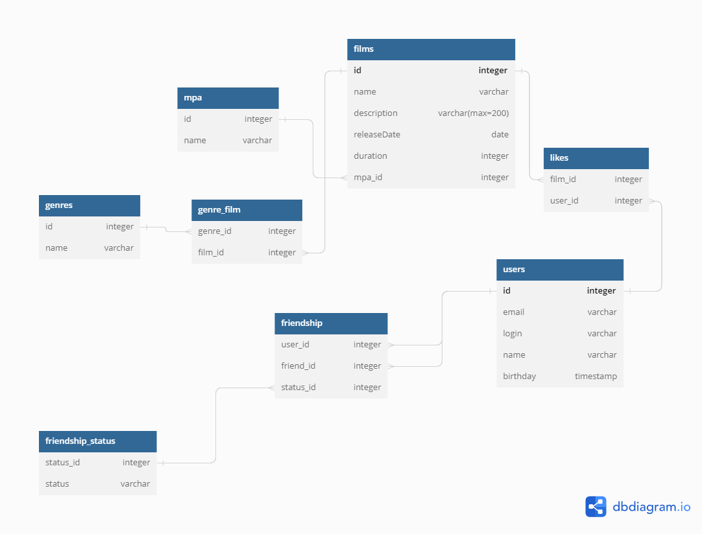

# java-filmorate
Template repository for Filmorate project.

## Проект "Фильмография"
#### Проект умеет:
1. Добавлять пользователя, добавлять их в друзья и отслеживать их лайки
2. Добавлять фильмы, ставить им лайки и сортировать по популярности
### Диаграмма базы данных проекта:
https://dbdiagram.io/d/645580dcdca9fb07c4988478



### Примеры запросов к базе данных:
Получение списка всех пользователей:

```
SELECT * 
FROM users;
```

Получение пользователей по ID:
``` 
 SELECT * 
 FROM users 
 WHERE user_id = ?; 
 ``` 
Получение списка друзей пользователя: 
 ``` 
SELECT * 
FROM users 
WHERE user_id IN (SELECT friend_id FROM friendship WHERE user_id = ?);
 ``` 


Получение списка из наиболее популярных фильмов:
 ``` 
 SELECT f.film_id, film_name, description, release_date, duration, mpa_rate_id FROM films AS f
LEFT JOIN films_likes AS fl ON f.film_id = fl.film_id
GROUP BY f.film_id
ORDER BY COUNT(fl.user_id) DESC
LIMIT ? 
 ``` 


